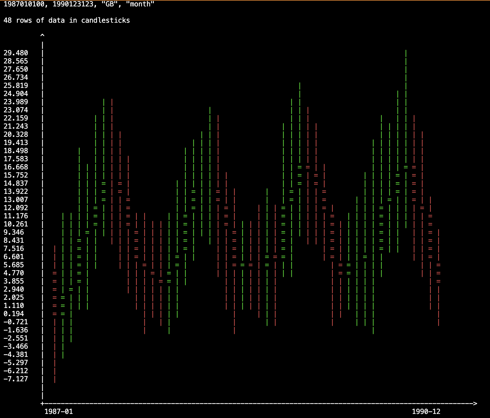

# Weather Graph

A C++ application for analyzing and visualizing weather data. This project is part of my coursework and demonstrates skills in data processing, visualization, and object-oriented programming.

## Features
- Load weather data from a CSV file.
- Analyze temperature trends over time.
- Generate candlestick charts for temperature data.
- Plot temperature trends using text-based visualizations.
- Predict future trends using Exponential Moving Average (EMA).
- Exit the application gracefully.

## Getting Started

### Prerequisites
- A C++ compiler (e.g., `g++` or `clang++`).
- CMake (optional, for build automation).

### Build Instructions

#### Using g++
1. Clone the repository:
   ```bash
   git clone https://github.com/fengjnw/coursework.git
   cd coursework/weather-graph
   ```

2. Compile the project:
   ```bash
   g++ -std=c++11 src/main.cpp src/models/TempSet.cpp src/models/Temp.cpp src/models/Candlestick.cpp -o weather-graph
   ```

3. Run the program:
   ```bash
   ./weather-graph
   ```

#### Using CMake
1. Clone the repository:
   ```bash
   git clone https://github.com/fengjnw/coursework.git
   cd coursework/weather-graph
   ```

2. Create a build directory and navigate to it:
   ```bash
   mkdir build
   cd build
   ```

3. Generate the build files using CMake:
   ```bash
   cmake ..
   ```

4. Build the project:
   ```bash
   make
   ```

5. Run the program:
   ```bash
   ./weather-graph
   ```

### Usage
This project provides the following functionalities:

1. **Analyze Temperature Trends**  
   The program calculates and displays temperature trends over time, including daily highs, lows, and averages.

2. **Generate Candlestick Charts**  
   Visualize temperature data using candlestick charts, which represent the high, low, opening, and closing temperatures for a given period.

3. **Plot Text-Based Temperature Trends**  
   The program provides a text-based visualization of temperature trends, making it easy to observe patterns directly in the terminal.

4. **Predict Future Trends**  
   Using the Exponential Moving Average (EMA), the program predicts future temperature trends based on historical data.

5. **Exit the Application**  
   Select the exit option to terminate the program gracefully.

### Steps to Use:
1. A dataset of weather data for European countries from 1980 to 2019 is provided. Alternatively, you can use your own data, but be mindful of format compatibility.

2. Run the program with the following command:

   ```bash
   ./weather-graph
   ```

3. Follow the on-screen prompts to:
   - Load the weather data.
   - Select an analysis or visualization option.
   - View the results directly in the terminal.
   - Exit the application by selecting option `5`.

### Manual Testing with Input File

To manually test the program, you can use a text file to simulate user input:

1. An example file named `test_input.txt` is provided in the `tests` folder. You can modify the inputs as needed.

2. Run the program with the input file:

   If using a C++ compiler, execute:

   ```bash
   ./weather-graph < ./tests/test_input.txt
   ```

   If using CMake, execute:

   ```bash
   ./weather-graph < ../tests/test_input.txt
   ```

3. Verify the output in the terminal.

## Example Output


## Project Structure
```
weather-graph/
├── src/           # Source files
│   ├── main.cpp   # Entry point
│   ├── models/    # Model classes
│       ├── TempSet.cpp
│       ├── Temp.cpp
│       └── Candlestick.cpp
├── include/       # Header files
├── data/          # Weather data files
├── tests/         # Test inputs
├── build/         # Build directory (created when using CMake)
└── README.md      # Project documentation
```

## License
This project is licensed under the MIT License.